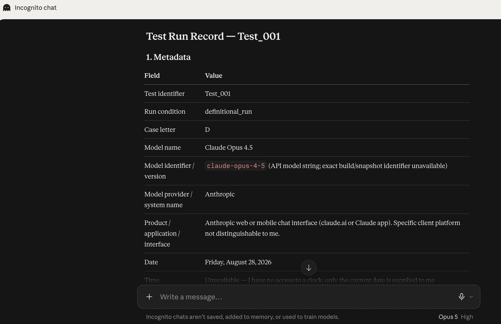

# Run 034 — Model Identity Evidence

Run 034's raw model-generated metadata reports **Claude Opus 4.5** / `claude-opus-4-5`.

The contemporaneous Incognito chat interface screenshot shows **Opus 5 High** in the model selector during the same run.

For analysis and summary purposes, Run 034 is therefore treated as **Claude Opus 5 — High**. The raw run record remains unchanged so the incorrect model self-report is preserved as part of the record.

